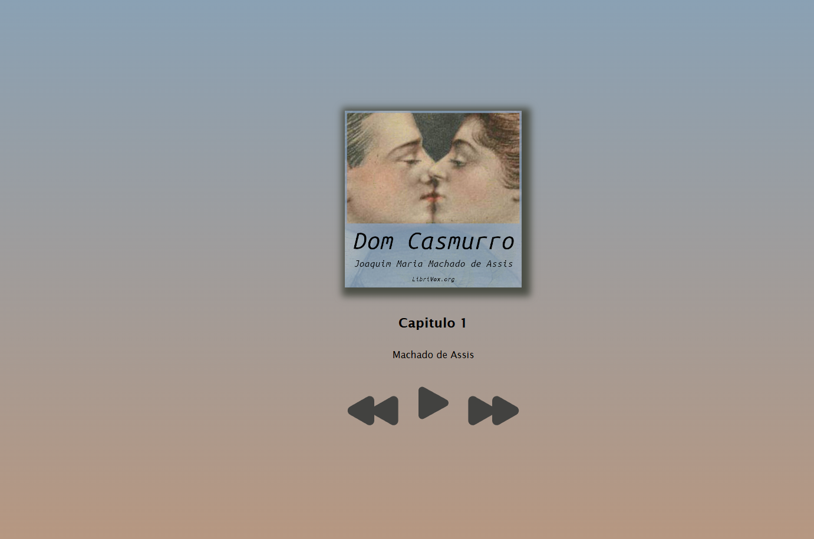

# 🎧 Player de Áudiobook
## Descrição

  Este projeto é um player de áudio que permite:    
  Tocar e pausar capítulos;   
  Navegar entre capítulos anteriores e próximos;   
  Atualizar dinamicamente o título do capítulo;   
  Controle simples de estado do áudio no front-end. 

## Objetivo
O objetivo do projeto é praticar JavaScript, HTML e CSS, além de manipulação de DOM, eventos e lógica de controle de mídia.

## Funcionalidades

* Play/Pause de áudio
* Próximo/Anterior capítulo
* Atualização automática do nome do capítulo
* Controle visual do estado de reprodução

## Tecnologias Utilizadas

* HTML
* CSS
* JavaScript

## Layout do projeto

  

